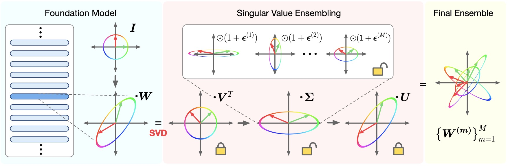

# Singular Value Ensembles for Foundation Model Uncertainty

[](https://arxiv.org/abs/2601.22068)
[](https://icml.cc/Conferences/2026)

Official repository for **"Quantifying the Uncertainty of Foundation Models with Singular Value Ensembles"**, accepted at **ICML 2026**.

**Mehmet Ozgur Turkoglu, Dominik J. Mühlematter, Alexander Becker, Konrad Schindler, Helge Aasen**

📄 [Paper](https://arxiv.org/abs/2601.22068)

> **Code release:** The implementation will be added to this repository.

---

## TL;DR

Deep ensembles are among the most reliable approaches for uncertainty estimation, but they require training and storing multiple complete models.

**Singular Value Ensemble (SVE)** turns a single pretrained foundation model into a parameter-efficient ensemble by sharing the pretrained weight structure and learning only **member-specific singular values**.

This provides ensemble-style uncertainty estimation with **less than 1% additional parameters** in typical settings.

---

## Method

<p align="center">
  
</p>

For a pretrained weight matrix:

$$
W = U \Sigma V^\top
$$

SVE keeps the singular-vector basis **U** and **V** shared across the ensemble, while each member learns its own singular values:

$$
W^{(m)} = U \Sigma^{(m)} V^\top
$$

where \(m\) denotes the ensemble member.

In other words:

* **U and V are shared** and preserve the representation learned during pretraining.
* **Singular values are member-specific** and determine how strongly each member uses the pretrained directions.
* Different singular-value configurations create diverse predictors without duplicating the complete foundation model.

The resulting predictions are combined in the same way as a standard ensemble.

---

## Why SVE?

A conventional deep ensemble stores a complete model for every member.

SVE instead shares almost the entire pretrained model and only introduces a small number of member-specific parameters.

This makes uncertainty estimation practical for large pretrained models, including foundation models with billions of parameters.

---

## Main Results

SVE is evaluated across vision and language models ranging from **22M to 7B parameters**.

Some representative results:

| Setting                        | Result                       |
| ------------------------------ | ---------------------------- |
| **DINO ViT-S/16 · Flowers102** | **95.4% accuracy, 1.0% ECE** |
| **LLaMA-2-7B · ARC-Easy**      | **85.8% accuracy, 3.8% ECE** |
| **CIFAR-100 → CIFAR-10 OOD**   | **81.6 AUROC**               |
| **BERT-base · 8 members**      | **~1% parameter overhead**   |

Across the experiments, SVE provides competitive calibration, epistemic uncertainty, OOD detection, and robustness while remaining substantially more parameter-efficient than conventional deep ensembles.

---

## Key Idea

> **Foundation models already provide a strong feature basis. Instead of training several complete models, SVE creates an ensemble by learning different reweightings of this shared pretrained basis.**

---

## Citation

```bibtex
@inproceedings{turkoglu2026singular,
  title     = {Quantifying the Uncertainty of Foundation Models with Singular Value Ensembles},
  author    = {Turkoglu, Mehmet Ozgur and M{\"u}hlematter, Dominik J. and Becker, Alexander and Schindler, Konrad and Aasen, Helge},
  booktitle = {Proceedings of the 43rd International Conference on Machine Learning},
  year      = {2026}
}
```
